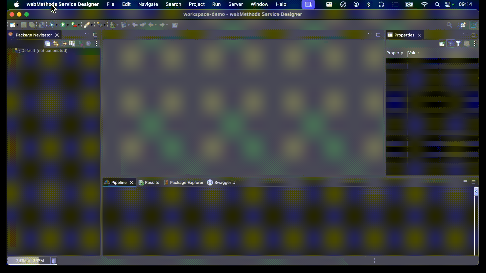

#   Development environment setup

Local service development is very much recommended for webMethods microservices. This means each developer should have in his/her local workstation:
-   a service designer (which is already installed locally, so nothing changes here)
-   a microservice runtime sandbox
-   a git client (we have one in the service designer that can be used)
-   local git repos

In the local workstation we could also have a messaging broker (UM, Kafka, ...) and one or several databases. But it's also fine to connect to remote resources as far as these components are concerned.  

A Git remote is of course needed (Gitlab, Github, ...) and it becomes the cornerstone of the development environment, allowing collaboration between developers and providing the source code for continuous integration.

There are several ways of setting up this development environment:
-   using the SAG installer
-   using the Service Designer bundle
-   using a container host to run the Microservice Runtime and the other local servers

##  Using the SAG installer

This is the traditional way of dealing with the installation of the Service Designer and other SAG products. 
You need to select the following items:
-   Designer (you can take the whole bundle, even though some features aren't needed for webMethods microservices)
-   Microservice Runtime
-   CloudStreams Server (if you need to work with CloudStreams connectors)
-   Database configuration (if you want to set up a webMethods database, which is optional)
-   Monitor and "Unit Test Framework" (under "Integration Server or Microservice Runtime packages")
-   The adapters that you need
-   Universal messaging (if you need it and want to install it locally)

The drawback with this approach is, you are only be able to fetch the products and features that are part of your contract and authorized to you in Empower.   

##  Using the Service Designer Bundle

You can go to this page to get the bundle: https://tech.forums.softwareag.com/t/webmethods-service-designer-download/235227
It contains:
-   Designer
-   Microservice Runtime
-   Unit Test Framework
-   The JDBC adapter

It focuses on quicly getting started with webMethods package development, with everything that a developer needs.  

##  Using a container host

With this approach we keep the Service Designer in the local workstation (installed using either the SAG installer or the Service Designer bundle), but the other server components are executed within containers, for instance using docker compose.  

This provides levers to standardize the development environment. Apart from the Service Designer, the other components are automatically installed and executed according to a docker-compose.yml descriptor.  
You can use a custom development base image for the Microservice Runtime, with all SAG packages, drivers, framework packages and other dependencies needed by developers. See https://github.com/staillansag/qdtBase for more details regarding development base images.

An example of such docker-compose.yml is provided under ./dev-runtime with:
-   a Posgres container, which is created using the official Postgres Docker hub image
-   a Universal messaging container, which is created using an image coming from SAG's Docker hub
-   a Microservice Runtime container, which is created using a custom development base image of mine

The product licenses are injected into the UM and MSR containers using volume mounts. For obvious reasons the license files are not pushed to Github, so you need to create a license subfolder and place within it the following two license files:
-   um-license.xml, with the XML content of your UM license
-   msr-license.xml, with the XML content of your MSR license

If you do not have a MSR license, you can fetch the one that's included in the Service Designer bundle, located in ./IntegrationServer/config/licenseKey.xml  

Persistence is managed for the three containers using named volumes, so you will not loose your data in case you need to recreate the containers.  

Database credentials are managed in a .env file that contains two DB_USER and DB_PASSWORD environment variables.  
MSR configuration is achieved using a application.properties file that's injected into the container. Within this file we have references to environment variables, using the $env{VARIABLE_NAME} notation. To inject environment variable values into the containers, we use the same .env file (which allows us to define database credentials in one single place and use them in multiple containers.)  

Finally, we also mount a volume into the MSR container to deal with version control. On host side we need a git directory that's placed at the root of the HOME folder and on container side we map it with a /git directory. These locations can be changed, but if you do so make sure to do the necessary adjustments when setting up [Local Service Development](./VersionControl.md).  

To start the Docker compose stack, use the following command: `docker-compose up -d`  (make sure you're in the folder where the docker-compose.yml file is located.)
To stop it, use `docker-compose down`  
To view the MSR logs, use `docker logs msr` 
To view the UM logs, use `docker logs umserver`

Note: in some environments, `docker-compose`will have to be replaced with `docker compose`

After you've started the Docker compose stack, you can plug the Designer to the containerized MSR.  

