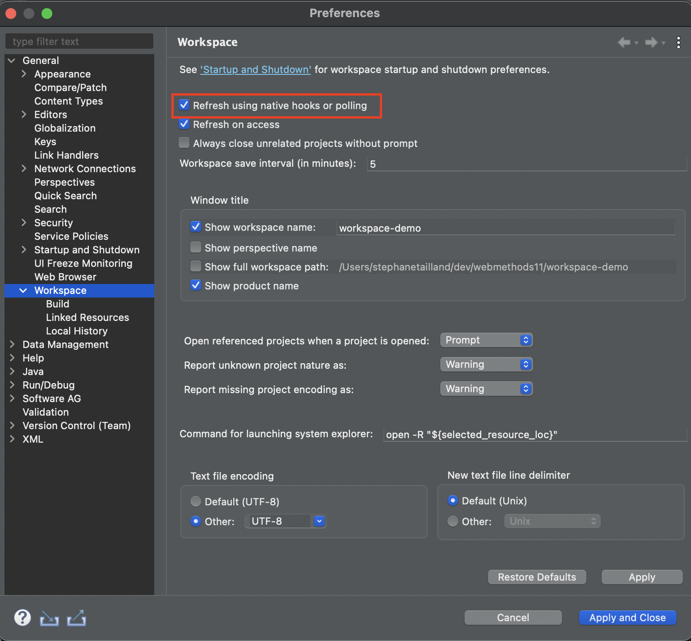
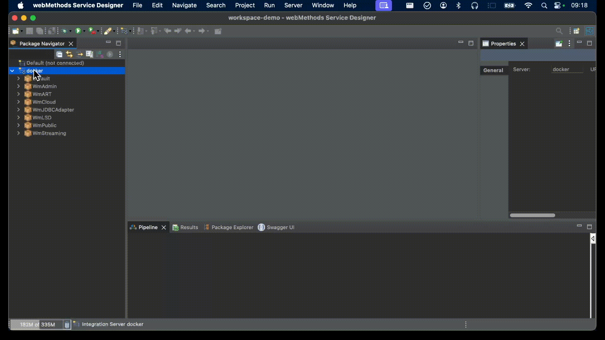
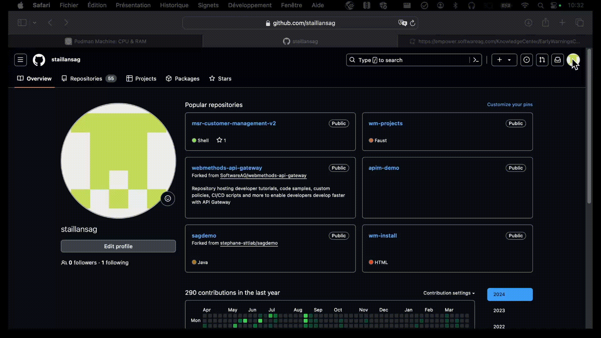
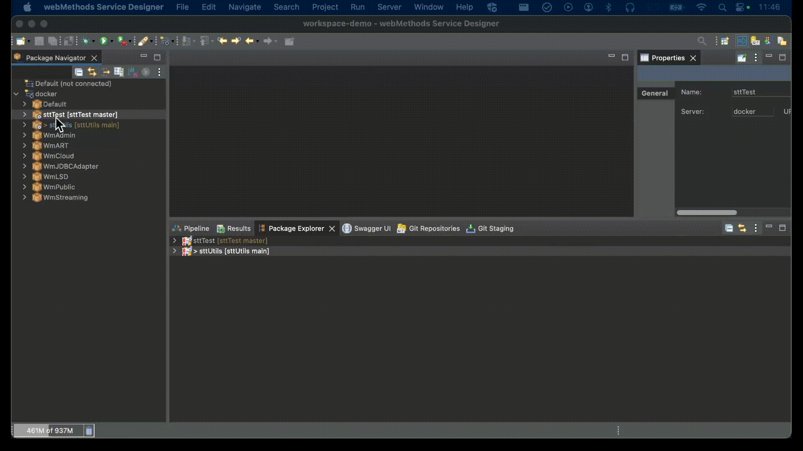
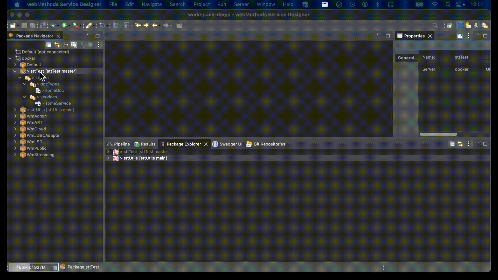

#  Version control of the webMethods packages

In the past, SAG used to recommend an "all packages into one Git repo" approach.  
With the recent introduction of the "Develop Anywhere, Deploy Anywhere" feature and the webMethods package manager, the recommended approach is now "one package into one Git repo". 
This is aligned with the autonomy, low coupling and composability principles associated with microservices.  

To manage packages in version control we can use the "Local Service Development" (LSD) feature of the Service Designer.  
In practice, any Git client could be used, but LSD provides some extra features that simplify the versioning of packages within containerized MSR.

##  Foreword

The "Local Service Development" (LSD) feature that we use to version webMethods packages relies on the Eclipse git client.  
There are a few specificities related to LSD, which I describe below. But once your packages are "version control" enabled, you follow practices that are very similar to what Java developers usually do in Eclipse.  
So I am only covering the LSD specifics and the git basics in this article. If you need to know more about git, or if you need advanced knowledge (for instance because you're stuck with a git push that is refused by the git remote), you can check the already existing online documentation.  

##  Local Service Development setup

### Activation workspace refresh

Activate "workspace refresh using native hooks or polling" in order to make the Eclipse Git client aware of changes that take place in the packages.  
This is done in the Eclipse preferences, under General > Workspaces.  


### Setup of LSD for containerized MSR

If you've decided to deploy the local MSR using a Docker container, there are a few additional steps. 

Go to the Eclipse preferences, under Software AG > Service Development > Local Service Development.  
Activate "Enable local service development in containerized Integration Server or Microservices Runtime".  
Then click on the "Add" button to add a volume, which needs to match the volume mount you've configured in your docker-compose.yml file. For instance for a volume mount `/Users/stephanetailland/git:/git` you need to configure:
-   Host Path = /Users/stephanetailland/git (what's before the semicolon)
-   Container Path = /git (what's after the semicolon)  

Finally, set the port to 15555 (or the port you've configured in the docker-compose.yml, if you've decided to change it.)  

Then go back to the package navigator. You need to install a WmLSD package that won't show up immediatly. Disconnect from the server and reconnect, make a right click and select "Install WmLSD package".  
From there, you're fully equipped to manage version control on the containerized MSR packages.


## Creating a new package and placing it under version control

This is done in three steps:
-   you create a local git repo for your package, using LSD
-   you create a remote git repo
-   you associate the local and remote git repos and make a first commit & push

### Creating the local git repo

Create a package in the package navigator, then right click on it and find the "Create Local Service Development Project" option and click on it.  
Click "OK" in the warning window that's displayed, it's about workspace refresh and we've already configured everything.  
If you're running your MSR containerized, then select your mount share (the window name is called "Repository", but that name isn't appropriate.)  
Then in the "Share Project" window, be sure to select "Use or create repository in parent folder or project", select the tickbox that's located at the left of your project and finally click on "Create Repository" and then finish.  



### Creating the remote Git repo

This part is vendor specific. I am showing an example with Github.  



### Performing the first commit & push

Go back to the Designer, right click on your package and find the Team menu. Within this menu, click on "Commit".  
In the "Git staging" view, add your changes to the Git staging area, add a commit message and click on the "Commit" button.  At that stage, you have committed your changes to your local git repo.  
In order to push your local changes to the remote Git repo, click on the "Push HEAD" button, still in the "Git staging" view.  
In the window that pops up, paste your remote git repo URI into the URI field. The other fields should populate automatically, except User and Password which need to be populated for your very first push to the git remote.  
Then click on "Preview" and finally "Push".  


Note: you can also choose to use the ssh protocol to interract with your git remote, in which case the Designer (and LSD) will use your ssh private key to authenticate.

## Importing a package from version control

Here I assume we import a package that is in a remote git repo dedicated to this package (one package - one git repo approach.)  

Importing a package is done in three steps:
-   clone the remote git repository locally
-   import the package
-   add the package to the Microservice Runtime

First, go to your git remote and copy the git repo URI (which should finish with ".git")  
Then, go back to the Designer and display the "Git repisitories" view.  
Do a right click on this view and select "Paste Repository Path or URI". The Designer automatically detects the git URI in your clipboard and fills in the "Clone Git Repository" window that's displayed.  
Click on "Next" twice, then "Finish".  

Still in the "Git Repositories" view, right click on the repo you've just cloned and select "Import Projects". Click on the "Finish" button in the window that's displayed.  

Finally, go to the "Package Explorer" view, right click on your package, find the "Move Project to IS Package" and click on it. This loads the package into the MSR and in the Package navigator.


Note: in the third step, the "Move Project to IS Package" option is only available if your git repo contains a .project file which contains a "com.softwareag.is.vcsintegration.nature" nature. If it's missing, you can add one according to the following template (be sure to replace "ReplaceWithYourPackageName" with your package name):
```
<?xml version="1.0" encoding="UTF-8"?>
<projectDescription>
	<name>ReplaceWithYourPackageName</name>
	<comment></comment>
	<projects>
	</projects>
	<buildSpec>
		<buildCommand>
			<name>org.eclipse.jdt.core.javabuilder</name>
			<arguments>
			</arguments>
		</buildCommand>
		<buildCommand>
			<name>com.softwareag.is.vcsintegration.ISPackageBuilder</name>
			<arguments>
			</arguments>
		</buildCommand>
	</buildSpec>
	<natures>
		<nature>org.eclipse.jdt.core.javanature</nature>
		<nature>com.softwareag.is.vcsintegration.nature</nature>
	</natures>
</projectDescription>
```

## Synchronizing with the Git remote

Before doing any change to the code, it's a good practice to synchronize the local git repo with its remote counterpart, in order to ensure you work with the latest changes.

To do so, in the Package Navigator right click on your package, go to the "Team" menu and click on "Pull".  



## Commmitting and pushing changes to the Git remote

Once you've finished with your changes, right click on your package in the Package Navigator, go to the "Team" menu and click on "Commit".  

Place your changes in the git staging area and provide a commit message.  
You can choose to only commit the changes in your local git repo, by clicking on the "Commit" button.  
Or you can choose to perform the local commit and remote push in one single step, by clicking on "Commit and Push".

